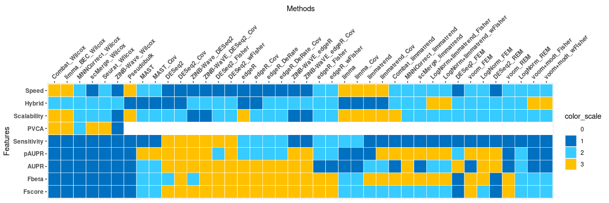
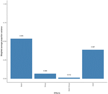
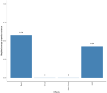
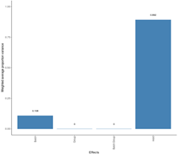
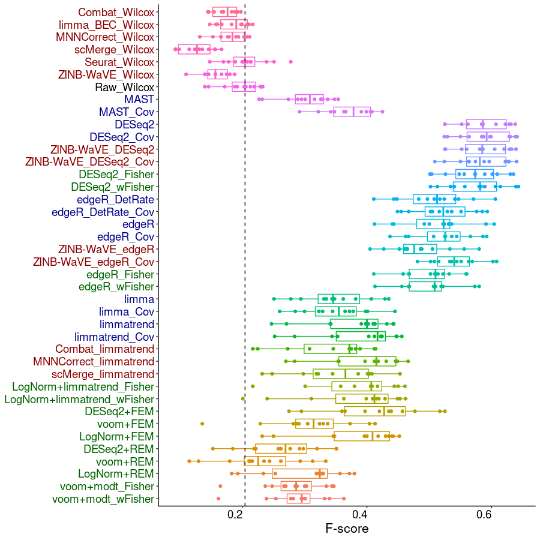
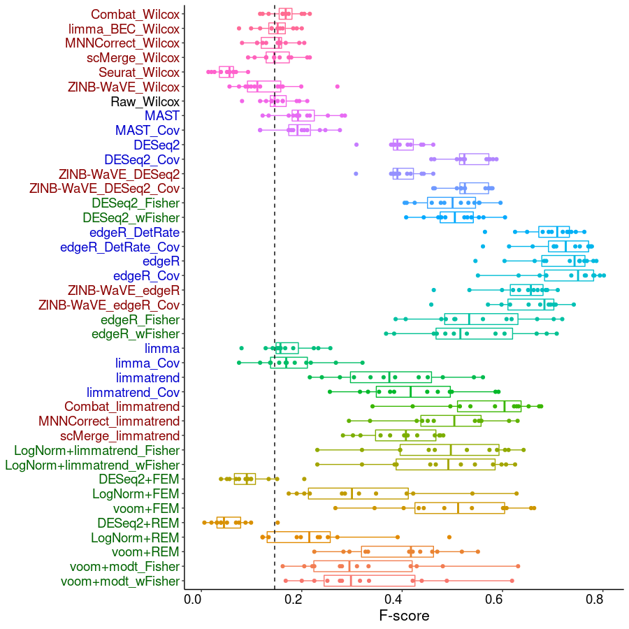
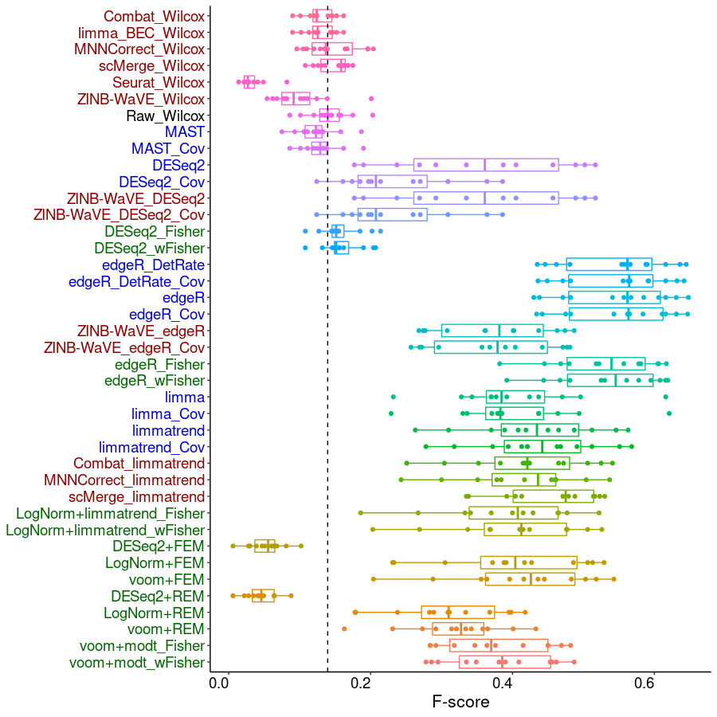
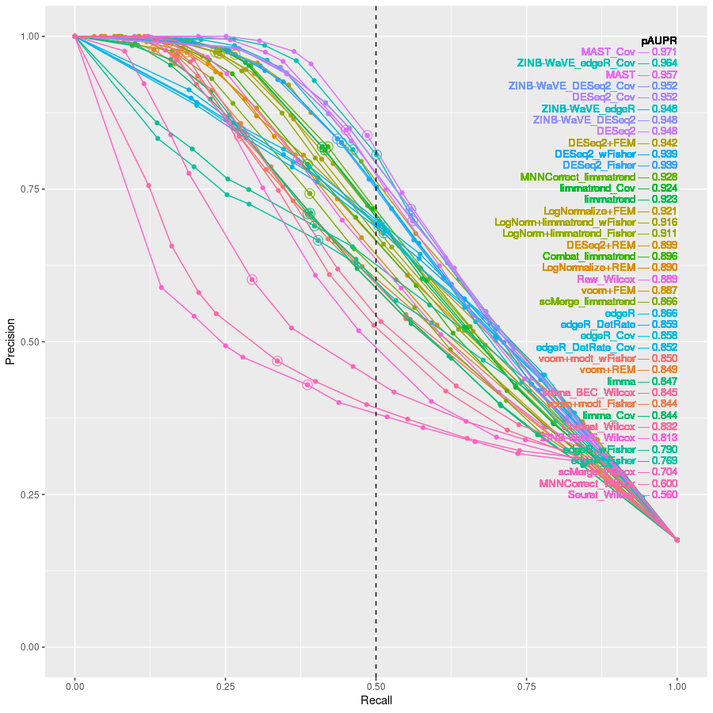
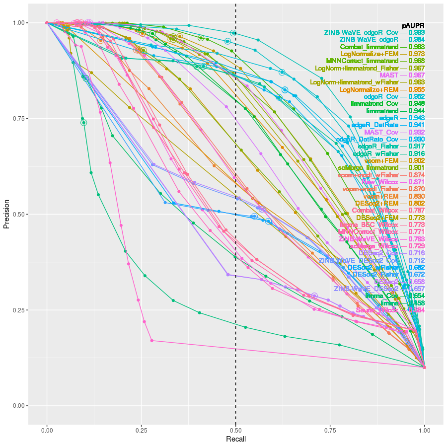
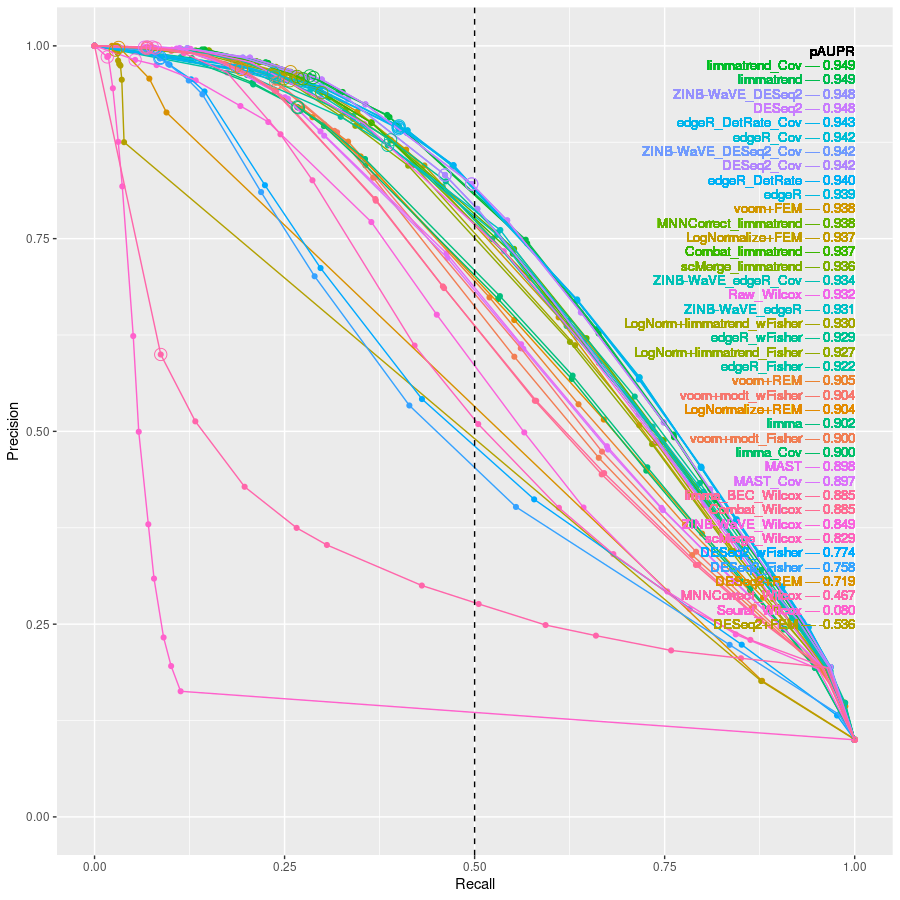

# On using batch-effect-corrected data for differential expressionanalysis of single-cell RNA sequencing data

### General performance of methods
 

### Performance (F-beta, Precision-recall curve) of selected methods on specific datasets
| **Splatter simulation** | **MCA (T-cell) data** | **Pancreas (Alpha cell) data** |
| --- | --- | --- |
|  |  |  |
|  |  |  |
|  |  |  |
|  |  |  |
