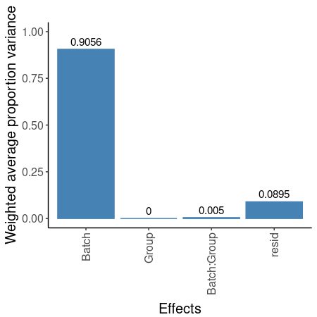

# Benchmarking integration of single-cell RNA-seq differential analysis
-------------------------------------------------------------------------------------------------------------------------

### General performance of methods
* This analysis demonstrates the high resolution and efficacy of integrative DE analysis for specific cell type as compared to the analysis of bulk sequencing data. Overall, this project covers over 40 integrative methods for scRNA-seq DE analysis and several different levels of batch effects, thus provides a guideline to integrating DE analysis of scRNA-seq data. 
 
 
### Performance of selected methods on specific datasets
* The general comparison of interested methods on 3 datasets using (A) Splatter  and model-free simulations: (B) MCA B-cell and (C) Pancreas data. (D-F) The correspoding evaluation of batch effect on each dataset using principal variance component analysis (PVCA). (G-I) The performance of F-beta score with β=0.5 to emphasize the role of precision. (J-L) The corresponding precision-recall curves of considering methods with pAUPR ranking.

| **Splatter simulation** | **MCA (T cells)** | **Pancreas (Alpha cells)** |
| --- | --- | --- |
|(A)  |(B)  |(C)  |
|(D)  |(E)  |(F)  |
|(G)  |(H)  |(I)  |
|(J)  |(K)  |(L)  |

*To whom correspondence should be addressed. Tel: +82-52-217-2525; Fax: +82-52-217-2639; Email: dougnam@unist.ac.kr
|-------------------------------------------------------------------------------------------------------------------------|
