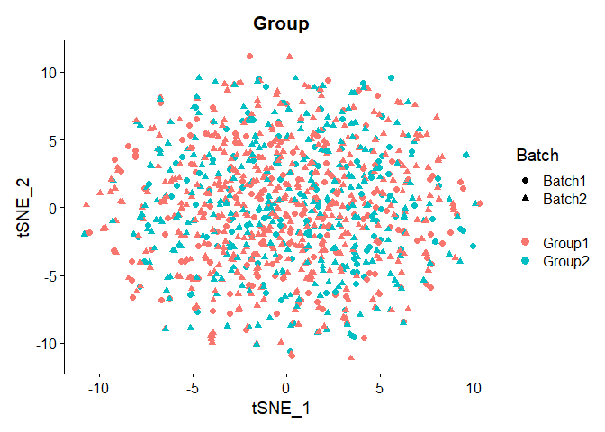
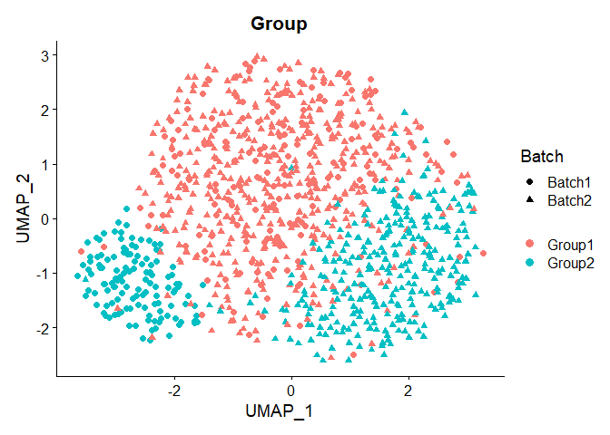

Incomplete association simulation with Splatter
================

``` r
rm(list=ls())

library(splatter)
```

    ## Loading required package: SingleCellExperiment

    ## Loading required package: SummarizedExperiment

    ## Loading required package: MatrixGenerics

    ## Loading required package: matrixStats

    ## Warning: package 'matrixStats' was built under R version 4.1.3

    ## 
    ## Attaching package: 'MatrixGenerics'

    ## The following objects are masked from 'package:matrixStats':
    ## 
    ##     colAlls, colAnyNAs, colAnys, colAvgsPerRowSet, colCollapse,
    ##     colCounts, colCummaxs, colCummins, colCumprods, colCumsums,
    ##     colDiffs, colIQRDiffs, colIQRs, colLogSumExps, colMadDiffs,
    ##     colMads, colMaxs, colMeans2, colMedians, colMins, colOrderStats,
    ##     colProds, colQuantiles, colRanges, colRanks, colSdDiffs, colSds,
    ##     colSums2, colTabulates, colVarDiffs, colVars, colWeightedMads,
    ##     colWeightedMeans, colWeightedMedians, colWeightedSds,
    ##     colWeightedVars, rowAlls, rowAnyNAs, rowAnys, rowAvgsPerColSet,
    ##     rowCollapse, rowCounts, rowCummaxs, rowCummins, rowCumprods,
    ##     rowCumsums, rowDiffs, rowIQRDiffs, rowIQRs, rowLogSumExps,
    ##     rowMadDiffs, rowMads, rowMaxs, rowMeans2, rowMedians, rowMins,
    ##     rowOrderStats, rowProds, rowQuantiles, rowRanges, rowRanks,
    ##     rowSdDiffs, rowSds, rowSums2, rowTabulates, rowVarDiffs, rowVars,
    ##     rowWeightedMads, rowWeightedMeans, rowWeightedMedians,
    ##     rowWeightedSds, rowWeightedVars

    ## Loading required package: GenomicRanges

    ## Loading required package: stats4

    ## Loading required package: BiocGenerics

    ## 
    ## Attaching package: 'BiocGenerics'

    ## The following objects are masked from 'package:stats':
    ## 
    ##     IQR, mad, sd, var, xtabs

    ## The following objects are masked from 'package:base':
    ## 
    ##     anyDuplicated, append, as.data.frame, basename, cbind, colnames,
    ##     dirname, do.call, duplicated, eval, evalq, Filter, Find, get, grep,
    ##     grepl, intersect, is.unsorted, lapply, Map, mapply, match, mget,
    ##     order, paste, pmax, pmax.int, pmin, pmin.int, Position, rank,
    ##     rbind, Reduce, rownames, sapply, setdiff, sort, table, tapply,
    ##     union, unique, unsplit, which.max, which.min

    ## Loading required package: S4Vectors

    ## Warning: package 'S4Vectors' was built under R version 4.1.3

    ## 
    ## Attaching package: 'S4Vectors'

    ## The following objects are masked from 'package:base':
    ## 
    ##     expand.grid, I, unname

    ## Loading required package: IRanges

    ## 
    ## Attaching package: 'IRanges'

    ## The following object is masked from 'package:grDevices':
    ## 
    ##     windows

    ## Loading required package: GenomeInfoDb

    ## Loading required package: Biobase

    ## Welcome to Bioconductor
    ## 
    ##     Vignettes contain introductory material; view with
    ##     'browseVignettes()'. To cite Bioconductor, see
    ##     'citation("Biobase")', and for packages 'citation("pkgname")'.

    ## 
    ## Attaching package: 'Biobase'

    ## The following object is masked from 'package:MatrixGenerics':
    ## 
    ##     rowMedians

    ## The following objects are masked from 'package:matrixStats':
    ## 
    ##     anyMissing, rowMedians

``` r
library(Seurat)
```

    ## Registered S3 method overwritten by 'spatstat.geom':
    ##   method     from
    ##   print.boxx cli

    ## Attaching SeuratObject

    ## 
    ## Attaching package: 'Seurat'

    ## The following object is masked from 'package:SummarizedExperiment':
    ## 
    ##     Assays

``` r
sparsity_level = .95

sim <- splatSimulate(group.prob=c(0.6, 0.4), nGenes=5000, batchCells=c(300, 750),
                     dropout.type='experiment', method= 'groups' ,seed=17, dropout.shape=-1, 
                     dropout.mid=3.9, 
                     de.prob = c(0.05, 0.05),
                     de.downProb = c(0.4, 0.4),
                     de.facLoc = 0.05,
                     de.facScale = 0.05,
                     batch.facLoc=0.01,
                     batch.facScale=0.01
                    )
```

    ## Getting parameters...

    ## Creating simulation object...

    ## Simulating library sizes...

    ## Simulating gene means...

    ## Simulating batch effects...

    ## Simulating group DE...

    ## Simulating cell means...

    ## Simulating BCV...

    ## Simulating counts...

    ## Simulating dropout (if needed)...

    ## Sparsifying assays...

    ## Automatically converting to sparse matrices, threshold = 0.95

    ## Skipping 'BatchCellMeans': estimated sparse size 1.5 * dense matrix

    ## Skipping 'BaseCellMeans': estimated sparse size 1.5 * dense matrix

    ## Skipping 'BCV': estimated sparse size 1.5 * dense matrix

    ## Skipping 'CellMeans': estimated sparse size 1.49 * dense matrix

    ## Skipping 'TrueCounts': estimated sparse size 2.01 * dense matrix

    ## Skipping 'DropProb': estimated sparse size 1.5 * dense matrix

    ## Skipping 'Dropout': estimated sparse size 1.79 * dense matrix

    ## Converting 'counts' to sparse matrix: estimated sparse size 0.31 * dense matrix

    ## Done!

``` r
tmpcount = counts(sim)
colsum = colSums(tmpcount == 0)
simsparsity = sum(colsum)/(5000*(300 + 750))
print("raw sparsity")
```

    ## [1] "raw sparsity"

``` r
print(simsparsity)
```

    ## [1] 0.8957535

``` r
counts <- as.data.frame(counts(sim))
geneinfo <- as.data.frame(rowData(sim))
cellinfo <- as.data.frame(colData(sim))

rowsum = rowSums(tmpcount==0)/length(colnames(tmpcount))
non_sparse_genes = rownames(tmpcount)[which(rowsum < sparsity_level)]
counts <- tmpcount[non_sparse_genes, ]
geneinfo <- geneinfo[non_sparse_genes, ]

rowsum = rowSums(counts == 0)
simsparsity = sum(rowsum)/(length(rownames(counts)) * length(colnames(counts)) )
print("after filtered sparsity")
```

    ## [1] "after filtered sparsity"

``` r
print(simsparsity)
```

    ## [1] 0.8000242

``` r
de_genes_ls <- rownames(geneinfo[(geneinfo$DEFacGroup1+geneinfo$DEFacGroup2)!=2,])
de_genes_df <- geneinfo[de_genes_ls,]

down_genes <- rownames(de_genes_df[de_genes_df$DEFacGroup1<de_genes_df$DEFacGroup2,])
up_genes <- de_genes_ls[!de_genes_ls %in% down_genes]
genes_deg <- c(up_genes, down_genes)

# Normal simulation distribution 
seu <- CreateSeuratObject(counts = counts)
seu <- AddMetaData(seu, cellinfo$Batch, col.name = "Batch")
seu <- AddMetaData(seu, cellinfo$Group, col.name = "Group")
seu <- SCTransform(seu)
```

    ## Calculating cell attributes from input UMI matrix: log_umi

    ## Variance stabilizing transformation of count matrix of size 2402 by 1050

    ## Model formula is y ~ log_umi

    ## Get Negative Binomial regression parameters per gene

    ## Using 2000 genes, 1050 cells

    ##   |                                                                              |                                                                      |   0%  |                                                                              |==================                                                    |  25%  |                                                                              |===================================                                   |  50%  |                                                                              |====================================================                  |  75%  |                                                                              |======================================================================| 100%

    ## Found 100 outliers - those will be ignored in fitting/regularization step

    ## Second step: Get residuals using fitted parameters for 2402 genes

    ##   |                                                                              |                                                                      |   0%  |                                                                              |==============                                                        |  20%  |                                                                              |============================                                          |  40%  |                                                                              |==========================================                            |  60%  |                                                                              |========================================================              |  80%  |                                                                              |======================================================================| 100%

    ## Computing corrected count matrix for 2402 genes

    ##   |                                                                              |                                                                      |   0%  |                                                                              |==============                                                        |  20%  |                                                                              |============================                                          |  40%  |                                                                              |==========================================                            |  60%  |                                                                              |========================================================              |  80%  |                                                                              |======================================================================| 100%

    ## Calculating gene attributes

    ## Wall clock passed: Time difference of 10.12685 secs

    ## Determine variable features

    ## Place corrected count matrix in counts slot

    ## Centering data matrix

    ## Set default assay to SCT

``` r
# PCA
seu <- RunPCA(seu, npcs = 30, verbose = FALSE)
# TSNE
seu <- RunTSNE(seu, dims = 1:30, seed.use = 7968)

DimPlot(seu, reduction = "tsne",
        group.by = "Group", shape.by="Batch", pt.size = 2,label = F, repel = T)
```

<!-- -->

``` r
#Incomplete association manipulation
a = b = 2

batch1 = batch1_ori = counts[, which(cellinfo$Batch=='Batch1')]
batch2 = batch2_ori = counts[, which(cellinfo$Batch=='Batch2')]

N = round(length(de_genes_ls)/3)
non_DEG = geneinfo$Gene[!geneinfo$Gene %in% de_genes_ls]

############################# batch 1
separated_DEG_1 = sample(non_DEG, N, replace=FALSE)
tumor = which(cellinfo$Group[which(cellinfo$Batch=='Batch1')]=='Group2')

tmp <- batch1[separated_DEG_1, tumor]
for (g in rownames(tmp)){
  for (c in colnames(tmp)){
    prob = rbeta(1, a, b)
    tmp[g, c] = rbinom(1, tmp[g, c], prob=prob)%/%2
  }
}
tmp <- round(tmp)
tmp -> batch1[separated_DEG_1, tumor]

############################# batch 2
non_DEG <- setdiff(non_DEG, separated_DEG_1)
separated_DEG_2 = sample(non_DEG, N, replace=FALSE)
tumor = which(cellinfo$Group[which(cellinfo$Batch=='Batch2')]=='Group2')

tmp <- batch2[separated_DEG_2, tumor]
for (g in rownames(tmp)){
  for (c in colnames(tmp)){
    prob = rbeta(1, a, b)
    tmp[g, c] = rbinom(1, tmp[g, c], prob=prob)%/%3
  }
}
tmp <- round(tmp)
tmp -> batch2[separated_DEG_2, tumor]


batch1 -> counts[, which(cellinfo$Batch=='Batch1')]
batch2 -> counts[, which(cellinfo$Batch=='Batch2')]

seu <- CreateSeuratObject(counts = counts)
seu <- AddMetaData(seu, cellinfo$Batch, col.name = "Batch")
seu <- AddMetaData(seu, cellinfo$Group, col.name = "Group")
seu <- SCTransform(seu)
```

    ## Calculating cell attributes from input UMI matrix: log_umi

    ## Variance stabilizing transformation of count matrix of size 2402 by 1050

    ## Model formula is y ~ log_umi

    ## Get Negative Binomial regression parameters per gene

    ## Using 2000 genes, 1050 cells

    ##   |                                                                              |                                                                      |   0%  |                                                                              |==================                                                    |  25%  |                                                                              |===================================                                   |  50%  |                                                                              |====================================================                  |  75%  |                                                                              |======================================================================| 100%

    ## Found 71 outliers - those will be ignored in fitting/regularization step

    ## Second step: Get residuals using fitted parameters for 2402 genes

    ##   |                                                                              |                                                                      |   0%  |                                                                              |==============                                                        |  20%  |                                                                              |============================                                          |  40%  |                                                                              |==========================================                            |  60%  |                                                                              |========================================================              |  80%  |                                                                              |======================================================================| 100%

    ## Computing corrected count matrix for 2402 genes

    ##   |                                                                              |                                                                      |   0%  |                                                                              |==============                                                        |  20%  |                                                                              |============================                                          |  40%  |                                                                              |==========================================                            |  60%  |                                                                              |========================================================              |  80%  |                                                                              |======================================================================| 100%

    ## Calculating gene attributes

    ## Wall clock passed: Time difference of 9.720946 secs

    ## Determine variable features

    ## Place corrected count matrix in counts slot

    ## Centering data matrix

    ## Set default assay to SCT

``` r
# PCA
seu <- RunPCA(seu, npcs = 30, verbose = FALSE)
# UMAP
seu <- RunTSNE(seu, dims = 1:30, seed.use = 7968)

DimPlot(seu, reduction = "tsne",
        group.by = "Group", shape.by="Batch", pt.size = 2,label = F, repel = TRUE)
```

<!-- -->
