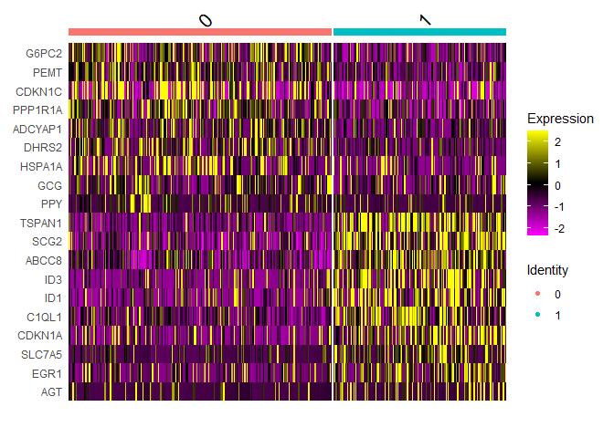

Model-free simulation with Pancreas data
================

``` r
# BiocManager::install('devtools')
# devtools::install_github('satijalab/seurat-data')
# BiocManager::install('Seurat')
library(SeuratData)
```
    ## -- Installed datasets ------------------------------------- SeuratData v0.2.1 --
    ## v panc8 3.0.2
    ## -------------------------------------- Key -------------------------------------
    ## v Dataset loaded successfully

``` r
library(Seurat)
```

    ## Registered S3 method overwritten by 'spatstat.geom':
    ##   method     from
    ##   print.boxx cli

    ## Attaching SeuratObject

``` r
base_name='pancreas'
SeuratData::InstallData("panc8")
```

    ## Warning: The following packages are already installed and will not be
    ## reinstalled: panc8

``` r
panc8 <- panc8.SeuratData::panc8

# split the object by dataset
pancreas.list <- SplitObject(panc8, split.by = "tech")

# selecting a specific cell type ('alpha' cells)
indrop_cells <- c(which(pancreas.list$indrop@meta.data$celltype=='beta'))

indrop_human1 <- c(which(pancreas.list$indrop$orig.ident == 'human1'))
indrop_cells_human1 <- intersect(indrop_cells, indrop_human1)
length(indrop_cells_human1) #  868 alpha
```

    ## [1] 868

``` r
indrop_human2 <- c(which(pancreas.list$indrop$orig.ident == 'human2'))  
indrop_cells_human2 <- intersect(indrop_cells, indrop_human2)
length(indrop_cells_human2) #  373 alpha
```

    ## [1] 373

``` r
# extract temporary batches
tmp_batch1 = pancreas.list$indrop@assays$RNA@counts[,indrop_cells_human1]
tmp_batch2 = pancreas.list$indrop@assays$RNA@counts[,indrop_cells_human2]
```

``` r
# detect sub-clusters if available
b1 <- CreateSeuratObject(tmp_batch1)
b1 <- SCTransform(b1)
```

    ## Calculating cell attributes from input UMI matrix: log_umi

    ## Variance stabilizing transformation of count matrix of size 12035 by 868

    ## Model formula is y ~ log_umi

    ## Get Negative Binomial regression parameters per gene

    ## Using 2000 genes, 868 cells

    ##   |                                                                              |                                                                      |   0%  |                                                                              |==================                                                    |  25%  |                                                                              |===================================                                   |  50%  |                                                                              |====================================================                  |  75%  |                                                                              |======================================================================| 100%

    ## Found 42 outliers - those will be ignored in fitting/regularization step

    ## Second step: Get residuals using fitted parameters for 12035 genes

    ##   |                                                                              |                                                                      |   0%  |                                                                              |===                                                                   |   4%  |                                                                              |======                                                                |   8%  |                                                                              |========                                                              |  12%  |                                                                              |===========                                                           |  16%  |                                                                              |==============                                                        |  20%  |                                                                              |=================                                                     |  24%  |                                                                              |====================                                                  |  28%  |                                                                              |======================                                                |  32%  |                                                                              |=========================                                             |  36%  |                                                                              |============================                                          |  40%  |                                                                              |===============================                                       |  44%  |                                                                              |==================================                                    |  48%  |                                                                              |====================================                                  |  52%  |                                                                              |=======================================                               |  56%  |                                                                              |==========================================                            |  60%  |                                                                              |=============================================                         |  64%  |                                                                              |================================================                      |  68%  |                                                                              |==================================================                    |  72%  |                                                                              |=====================================================                 |  76%  |                                                                              |========================================================              |  80%  |                                                                              |===========================================================           |  84%  |                                                                              |==============================================================        |  88%  |                                                                              |================================================================      |  92%  |                                                                              |===================================================================   |  96%  |                                                                              |======================================================================| 100%

    ## Computing corrected count matrix for 12035 genes

    ##   |                                                                              |                                                                      |   0%  |                                                                              |===                                                                   |   4%  |                                                                              |======                                                                |   8%  |                                                                              |========                                                              |  12%  |                                                                              |===========                                                           |  16%  |                                                                              |==============                                                        |  20%  |                                                                              |=================                                                     |  24%  |                                                                              |====================                                                  |  28%  |                                                                              |======================                                                |  32%  |                                                                              |=========================                                             |  36%  |                                                                              |============================                                          |  40%  |                                                                              |===============================                                       |  44%  |                                                                              |==================================                                    |  48%  |                                                                              |====================================                                  |  52%  |                                                                              |=======================================                               |  56%  |                                                                              |==========================================                            |  60%  |                                                                              |=============================================                         |  64%  |                                                                              |================================================                      |  68%  |                                                                              |==================================================                    |  72%  |                                                                              |=====================================================                 |  76%  |                                                                              |========================================================              |  80%  |                                                                              |===========================================================           |  84%  |                                                                              |==============================================================        |  88%  |                                                                              |================================================================      |  92%  |                                                                              |===================================================================   |  96%  |                                                                              |======================================================================| 100%

    ## Calculating gene attributes

    ## Wall clock passed: Time difference of 12.99315 secs

    ## Determine variable features

    ## Place corrected count matrix in counts slot

    ## Centering data matrix

    ## Set default assay to SCT

``` r
# PCA
b1 <- RunPCA(b1, npcs = 75, verbose = FALSE)
# TSNE
b1 <- RunTSNE(b1, dims = 1:75, seed.use = 7968)

b1 <- FindNeighbors(b1, verbose = FALSE, dims = 1:75)
b1 <- FindClusters(b1, algorithm = 1, random.seed = 7968, resolution = 0.5)
```

    ## Modularity Optimizer version 1.3.0 by Ludo Waltman and Nees Jan van Eck
    ## 
    ## Number of nodes: 868
    ## Number of edges: 76205
    ## 
    ## Running Louvain algorithm...
    ## Maximum modularity in 10 random starts: 0.6465
    ## Number of communities: 3
    ## Elapsed time: 0 seconds

``` r
DimPlot(b1, reduction = "tsne", group.by = "seurat_clusters", label = TRUE)
```

<!-- -->

``` r
b2 <- CreateSeuratObject(tmp_batch2)
b2 <- SCTransform(b2)
```

    ## Calculating cell attributes from input UMI matrix: log_umi

    ## Variance stabilizing transformation of count matrix of size 10741 by 373

    ## Model formula is y ~ log_umi

    ## Get Negative Binomial regression parameters per gene

    ## Using 2000 genes, 373 cells

    ##   |                                                                              |                                                                      |   0%  |                                                                              |==================                                                    |  25%  |                                                                              |===================================                                   |  50%  |                                                                              |====================================================                  |  75%  |                                                                              |======================================================================| 100%

    ## Found 50 outliers - those will be ignored in fitting/regularization step

    ## Second step: Get residuals using fitted parameters for 10741 genes

    ##   |                                                                              |                                                                      |   0%  |                                                                              |===                                                                   |   5%  |                                                                              |======                                                                |   9%  |                                                                              |==========                                                            |  14%  |                                                                              |=============                                                         |  18%  |                                                                              |================                                                      |  23%  |                                                                              |===================                                                   |  27%  |                                                                              |======================                                                |  32%  |                                                                              |=========================                                             |  36%  |                                                                              |=============================                                         |  41%  |                                                                              |================================                                      |  45%  |                                                                              |===================================                                   |  50%  |                                                                              |======================================                                |  55%  |                                                                              |=========================================                             |  59%  |                                                                              |=============================================                         |  64%  |                                                                              |================================================                      |  68%  |                                                                              |===================================================                   |  73%  |                                                                              |======================================================                |  77%  |                                                                              |=========================================================             |  82%  |                                                                              |============================================================          |  86%  |                                                                              |================================================================      |  91%  |                                                                              |===================================================================   |  95%  |                                                                              |======================================================================| 100%

    ## Computing corrected count matrix for 10741 genes

    ##   |                                                                              |                                                                      |   0%  |                                                                              |===                                                                   |   5%  |                                                                              |======                                                                |   9%  |                                                                              |==========                                                            |  14%  |                                                                              |=============                                                         |  18%  |                                                                              |================                                                      |  23%  |                                                                              |===================                                                   |  27%  |                                                                              |======================                                                |  32%  |                                                                              |=========================                                             |  36%  |                                                                              |=============================                                         |  41%  |                                                                              |================================                                      |  45%  |                                                                              |===================================                                   |  50%  |                                                                              |======================================                                |  55%  |                                                                              |=========================================                             |  59%  |                                                                              |=============================================                         |  64%  |                                                                              |================================================                      |  68%  |                                                                              |===================================================                   |  73%  |                                                                              |======================================================                |  77%  |                                                                              |=========================================================             |  82%  |                                                                              |============================================================          |  86%  |                                                                              |================================================================      |  91%  |                                                                              |===================================================================   |  95%  |                                                                              |======================================================================| 100%

    ## Calculating gene attributes

    ## Wall clock passed: Time difference of 6.783844 secs

    ## Determine variable features

    ## Place corrected count matrix in counts slot

    ## Centering data matrix

    ## Set default assay to SCT

``` r
# PCA
b2 <- RunPCA(b2, npcs = 75, verbose = FALSE)
# TSNE
b2 <- RunTSNE(b2, dims = 1:75, seed.use = 7968)

b2 <- FindNeighbors(b2, verbose = FALSE, dims = 1:75)
b2 <- FindClusters(b2, algorithm = 3, random.seed = 7968, resolution = 0.5)
```

    ## Modularity Optimizer version 1.3.0 by Ludo Waltman and Nees Jan van Eck
    ## 
    ## Number of nodes: 373
    ## Number of edges: 36645
    ## 
    ## Running smart local moving algorithm...
    ## Maximum modularity in 10 random starts: 0.5367
    ## Number of communities: 2
    ## Elapsed time: 0 seconds

``` r
DimPlot(b2, reduction = "tsne", group.by = "seurat_clusters", label = TRUE)
```

<!-- -->

``` r
library(dplyr)
```

    ## 
    ## Attaching package: 'dplyr'

    ## The following objects are masked from 'package:stats':
    ## 
    ##     filter, lag

    ## The following objects are masked from 'package:base':
    ## 
    ##     intersect, setdiff, setequal, union

``` r
# find markers for every cluster compared to all remaining cells, report only the positive ones
b1.markers <- FindAllMarkers(b1, only.pos = TRUE, logfc.threshold = 0.25)
```

    ## Calculating cluster 0

    ## Calculating cluster 1

    ## Calculating cluster 2

``` r
b1.markers %>% group_by(cluster) %>% top_n(n = 10, wt = avg_log2FC)
```

    ## # A tibble: 30 x 7
    ## # Groups:   cluster [3]
    ##       p_val avg_log2FC pct.1 pct.2 p_val_adj cluster gene   
    ##       <dbl>      <dbl> <dbl> <dbl>     <dbl> <fct>   <chr>  
    ##  1 3.42e-66      1.33  0.98  0.689  4.12e-62 0       SLC30A8
    ##  2 9.45e-55      1.16  0.989 0.786  1.14e-50 0       ERO1B  
    ##  3 6.00e-54      1.38  0.973 0.748  7.23e-50 0       VGF    
    ##  4 2.11e-53      1.43  0.953 0.777  2.54e-49 0       PCSK1  
    ##  5 3.98e-52      1.17  0.98  0.827  4.79e-48 0       SCG2   
    ##  6 4.53e-51      1.34  1     0.997  5.45e-47 0       IAPP   
    ##  7 3.29e-50      1.42  0.905 0.604  3.95e-46 0       ABCC8  
    ##  8 1.01e-46      1.12  0.978 0.871  1.22e-42 0       PAM    
    ##  9 6.05e-46      1.33  0.985 0.877  7.28e-42 0       CHGA   
    ## 10 1.32e-38      0.965 0.955 0.814  1.58e-34 0       CHGB   
    ## # ... with 20 more rows

``` r
top10_1 <- b1.markers %>% top_n(n = 10, wt = avg_log2FC)

# find markers for every cluster compared to all remaining cells, report only the positive ones
b2.markers <- FindAllMarkers(b2, only.pos = TRUE, min.pct = 0.25, logfc.threshold = 0.25)
```

    ## Calculating cluster 0

    ## Calculating cluster 1

``` r
b2.markers %>% group_by(cluster) %>% top_n(n = 10, wt = avg_log2FC)
```

    ## # A tibble: 20 x 7
    ## # Groups:   cluster [2]
    ##       p_val avg_log2FC pct.1 pct.2 p_val_adj cluster gene   
    ##       <dbl>      <dbl> <dbl> <dbl>     <dbl> <fct>   <chr>  
    ##  1 4.69e-10      0.747 0.911 0.764  5.03e- 6 0       G6PC2  
    ##  2 9.63e-10      0.609 0.964 0.885  1.03e- 5 0       PEMT   
    ##  3 1.32e- 8      0.518 0.698 0.426  1.41e- 4 0       HOPX   
    ##  4 6.50e- 7      0.992 0.898 0.797  6.98e- 3 0       CDKN1C 
    ##  5 7.02e- 7      0.508 0.96  0.865  7.54e- 3 0       PPP1R1A
    ##  6 8.74e- 6      0.615 0.813 0.676  9.39e- 2 0       ADCYAP1
    ##  7 1.55e- 5      0.652 0.671 0.541  1.67e- 1 0       DHRS2  
    ##  8 4.90e- 4      0.620 0.609 0.466  1   e+ 0 0       HSPA1A 
    ##  9 8.42e- 3      0.634 0.938 0.899  1   e+ 0 0       GCG    
    ## 10 9.98e- 3      1.73  0.369 0.243  1   e+ 0 0       PPY    
    ## 11 1.55e-25      1.42  0.905 0.591  1.66e-21 1       TSPAN1 
    ## 12 2.51e-20      0.982 0.98  0.964  2.70e-16 1       SCG2   
    ## 13 1.13e-18      0.851 0.986 0.982  1.21e-14 1       ABCC8  
    ## 14 2.42e-15      1.09  0.75  0.351  2.60e-11 1       ID3    
    ## 15 1.31e-13      1.10  0.818 0.507  1.41e- 9 1       ID1    
    ## 16 2.79e-13      0.817 0.986 0.969  3.00e- 9 1       C1QL1  
    ## 17 8.27e-13      1.12  0.851 0.587  8.88e- 9 1       CDKN1A 
    ## 18 3.82e-12      0.738 0.595 0.253  4.10e- 8 1       SLC7A5 
    ## 19 3.76e-11      0.764 0.73  0.387  4.04e- 7 1       EGR1   
    ## 20 1.28e- 4      0.805 0.324 0.173  1   e+ 0 1       AGT

``` r
top10_2 <- b2.markers %>% group_by(cluster) %>% top_n(n = 10, wt = avg_log2FC)
```

``` r
DoHeatmap(b1, features = top10_1$gene)
```

    ## Warning in DoHeatmap(b1, features = top10_1$gene): The following features were
    ## omitted as they were not found in the scale.data slot for the SCT assay: IAPP

<!-- -->

``` r
DoHeatmap(b2, features = top10_2$gene)
```

    ## Warning in DoHeatmap(b2, features = top10_2$gene): The following features were
    ## omitted as they were not found in the scale.data slot for the SCT assay: HOPX

<!-- -->

``` r
b1c0 <- b1.markers$gene[b1.markers$cluster==0 ]
b1c1 <- b1.markers$gene[b1.markers$cluster==1 ]
b1c2 <- b1.markers$gene[b1.markers$cluster==2 ]

b2c0 <- b2.markers$gene[b2.markers$cluster==0 ]
b2c1 <- b2.markers$gene[b2.markers$cluster==1 ]

length(intersect(b1c0, b2c0)) 
```

    ## [1] 17

``` r
length(intersect(b1c0, b2c1)) # ---> picked 
```

    ## [1] 77

``` r
length(intersect(b1c1, b2c0)) 
```

    ## [1] 1

``` r
length(intersect(b1c1, b2c1)) 
```

    ## [1] 14

``` r
length(intersect(b1c2, b2c0)) 
```

    ## [1] 17

``` r
length(intersect(b1c2, b2c1)) 
```

    ## [1] 3

``` r
length(which(b1$seurat_clusters == 0))
```

    ## [1] 550

``` r
length(which(b2$seurat_clusters == 1))
```

    ## [1] 148

``` r
K = 3
cutoff = 0.95
a = 2
b = 2
pp = 10

# clustered matching
batch1 <- tmp_batch1[ ,which(b1$seurat_clusters == 0)]
batch2 <- tmp_batch2[ ,which(b2$seurat_clusters == 1)]
batch <- c(rep(1, length(colnames(batch1))), rep(2, length(colnames(batch2))))

# shuffling replicates    
ori_cell_order <- colnames(batch1)
sp_cells <- colnames(batch1)
sp_cells <- sample(sp_cells, length(sp_cells), replace = FALSE)
batch1 <- batch1[, sp_cells]
colnames(batch1) <- ori_cell_order

ori_cell_order <- colnames(batch2)
sp_cells <- colnames(batch2)
sp_cells <- sample(sp_cells, length(sp_cells), replace = FALSE)
batch2 <- batch2[, sp_cells]
colnames(batch2) <- ori_cell_order

# naming new groups
group <- batch
for (i in unique(group)){
  gid = which(group==i)
  group[gid[1:(length(gid)%/%10*2)]] = paste0(i, "_A")
  group[gid[((length(gid)%/%10*2) + 1):length(gid) ]] = paste0(i, "_B")
}

# picking common genes
rowsum = rowSums(as.matrix(batch1)==0)/length(colnames(batch1))
rowsum2 = rowSums(as.matrix(batch2)==0)/length(colnames(batch2))
gb1 = rownames(batch1)[which(rowsum < cutoff)]
print(length(gb1))
```

    ## [1] 8166

``` r
gb2 = rownames(batch2)[which(rowsum2 < cutoff)]
print(length(gb2))
```

    ## [1] 8034

``` r
common_genes = intersect(gb1, gb2)
print(length(common_genes))
```

    ## [1] 7405

``` r
# picking simulated DE genes in each batch
batch1 = batch1[common_genes, ]  
batch2 = batch2[common_genes, ]  
colnames(batch1)<-(group[which(batch==1)])  
colnames(batch2)<-(group[which(batch==2)])

N = round(length(common_genes) *pp /50)  #
if (N%%2==1) N = N + 1
print(N)
```

    ## [1] 1482

``` r
DEG_groundthruth = sample(common_genes, N, replace=FALSE)
second_N_genes  = sample(DEG_groundthruth, N%/%2, replace = FALSE)
first_N_genes= DEG_groundthruth[!DEG_groundthruth %in% second_N_genes]
```

``` r
#Down sampling
batch1_ori = batch1
batch2_ori = batch2

############################# batch 1
tmp <- batch1[first_N_genes, which(colnames(batch1)==unique(colnames(batch1))[1])]
for (idx in 1:length(tmp@x)){
  prob = rbeta(1, a, b)
  tmp@x[idx] = rbinom(1, tmp@x[idx], prob=prob)
}
batch1[first_N_genes, which(colnames(batch1)==unique(colnames(batch1))[1])] <- tmp

tmp <- batch1[second_N_genes, which(colnames(batch1)==unique(colnames(batch1))[2])]
for (idx in 1:length(tmp@x)){
  prob = rbeta(1, a, b)
  tmp@x[idx] = rbinom(1, tmp@x[idx], prob=prob)
}
batch1[second_N_genes, which(colnames(batch1)==unique(colnames(batch1))[2])] <- tmp

############################# batch 2
tmp <- batch2[first_N_genes, which(colnames(batch2)==unique(colnames(batch2))[1])]
for (idx in 1:length(tmp@x)){
  prob = rbeta(1, a, b)
  tmp@x[idx] = rbinom(1, tmp@x[idx], prob=prob)
}
batch2[first_N_genes, which(colnames(batch2)==unique(colnames(batch2))[1])] <- tmp

tmp <- batch2[second_N_genes, which(colnames(batch2)==unique(colnames(batch2))[2])]
for (idx in 1:length(tmp@x)){
  prob = rbeta(1, a, b)
  tmp@x[idx] = rbinom(1, tmp@x[idx], prob=prob)
}
batch2[second_N_genes, which(colnames(batch2)==unique(colnames(batch2))[2])] <- tmp

##################################################
print("bach1")
```

    ## [1] "bach1"

``` r
mb1=as.matrix(batch1)
# print(mean(mb1))
print(mean(mb1[mb1 > 0]))
```

    ## [1] 3.168973

``` r
print(max(mb1))
```

    ## [1] 3168

``` r
colsum = colSums(as.matrix(mb1) == 0)
simsparsity = sum(colsum)/(length(rownames(mb1))*length(colnames(mb1)))
print(simsparsity)
```

    ## [1] 0.7633675

``` r
print("batch2")
```

    ## [1] "batch2"

``` r
mb2=as.matrix(batch2)
# print(mean(mb2))
print(mean(mb2[mb2 > 0]))
```

    ## [1] 2.687177

``` r
print(max(mb2))
```

    ## [1] 2306

``` r
colsum = colSums(as.matrix(mb2) == 0)
simsparsity = sum(colsum)/(length(rownames(mb2))*length(colnames(mb2)))
print(simsparsity)
```

    ## [1] 0.7625189

``` r
print("all batches")
```

    ## [1] "all batches"

``` r
# assign new batch & group labels
batch1 <- batch1[, which(colnames(batch1)=='1_B')]
colnames(batch1) <- rep('1_B', length(colnames(batch1)))
first_half <- length(colnames(batch1)) %/% 2
colnames(batch1)[1:first_half] <- rep('1_A', first_half)

batch2 <- batch2[, which(colnames(batch2)=='2_B')]
colnames(batch2) <- rep('2_B', length(colnames(batch2)))
first_half <- length(colnames(batch2)) %/% 2
colnames(batch2)[1:first_half] <- rep('2_A', first_half)

tbatch <- c(rep(1, length(colnames(batch1))), rep(2, length(colnames(batch2))) )
##################################################
newmat <- cbind(batch1, batch2)

colsum = colSums(as.matrix(newmat) == 0)
simsparsity = sum(colsum)/(length(rownames(newmat))*length(colnames(newmat)))
print(simsparsity)
```

    ## [1] 0.7628299

``` r
newgroup<-colnames(newmat)
newgroup[newgroup=='1_A'] = 'A'
newgroup[newgroup=='1_B'] = 'B'
newgroup[newgroup=='2_A'] = 'A'
newgroup[newgroup=='2_B'] = 'B'
```

``` r
# visualize the data distribution
newbatch<-tbatch
geneinfo <- common_genes
cellinfo <- as.data.frame(newgroup)
cellinfo$batch <- factor(newbatch)

colnames(cellinfo) <- c("Group", "Batch")
up_genes <- second_N_genes
down_genes <- first_N_genes
de_genes <- DEG_groundthruth

library(ggplot2)
library(Seurat)
seu <- CreateSeuratObject(counts=as.matrix(newmat))
```

    ## Warning: Non-unique cell names (colnames) present in the input matrix, making
    ## unique

``` r
seu <- SCTransform(seu)
```

    ## Calculating cell attributes from input UMI matrix: log_umi

    ## Variance stabilizing transformation of count matrix of size 7405 by 560

    ## Model formula is y ~ log_umi

    ## Get Negative Binomial regression parameters per gene

    ## Using 2000 genes, 560 cells

    ##   |                                                                              |                                                                      |   0%  |                                                                              |==================                                                    |  25%  |                                                                              |===================================                                   |  50%  |                                                                              |====================================================                  |  75%  |                                                                              |======================================================================| 100%

    ## Second step: Get residuals using fitted parameters for 7405 genes

    ##   |                                                                              |                                                                      |   0%  |                                                                              |=====                                                                 |   7%  |                                                                              |=========                                                             |  13%  |                                                                              |==============                                                        |  20%  |                                                                              |===================                                                   |  27%  |                                                                              |=======================                                               |  33%  |                                                                              |============================                                          |  40%  |                                                                              |=================================                                     |  47%  |                                                                              |=====================================                                 |  53%  |                                                                              |==========================================                            |  60%  |                                                                              |===============================================                       |  67%  |                                                                              |===================================================                   |  73%  |                                                                              |========================================================              |  80%  |                                                                              |=============================================================         |  87%  |                                                                              |=================================================================     |  93%  |                                                                              |======================================================================| 100%

    ## Computing corrected count matrix for 7405 genes

    ##   |                                                                              |                                                                      |   0%  |                                                                              |=====                                                                 |   7%  |                                                                              |=========                                                             |  13%  |                                                                              |==============                                                        |  20%  |                                                                              |===================                                                   |  27%  |                                                                              |=======================                                               |  33%  |                                                                              |============================                                          |  40%  |                                                                              |=================================                                     |  47%  |                                                                              |=====================================                                 |  53%  |                                                                              |==========================================                            |  60%  |                                                                              |===============================================                       |  67%  |                                                                              |===================================================                   |  73%  |                                                                              |========================================================              |  80%  |                                                                              |=============================================================         |  87%  |                                                                              |=================================================================     |  93%  |                                                                              |======================================================================| 100%

    ## Calculating gene attributes

    ## Wall clock passed: Time difference of 8.110291 secs

    ## Determine variable features

    ## Place corrected count matrix in counts slot

    ## Centering data matrix

    ## Set default assay to SCT

``` r
# Add cell type annotation to metadata
seu <- AddMetaData(seu, cellinfo$Batch, col.name = "Batch")
seu <- AddMetaData(seu, cellinfo$Group, col.name = "Group")

# PCA
seu <- RunPCA(seu, npcs = 30, verbose = FALSE)
# TSNE
seu <- RunTSNE(seu, dims = 1:30, seed.use = 7968)
```

``` r
DimPlot(seu, reduction = "tsne",
        group.by = "Group", shape.by="Batch", pt.size = 2,label = F, repel = TRUE) +
  theme(plot.title = element_blank())
```

<!-- -->
